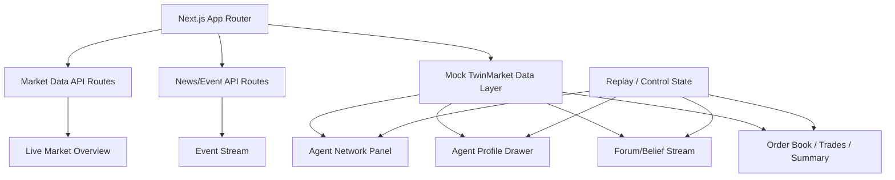

# TwinMarket UI — OpenClaw 任务计划

## 元规则
- **进度追踪**：每完成一个 Step，在本文件对应条目前打 `[x]`，并在该条目下方追加一行 `> 完成时间: YYYY-MM-DD HH:MM | 摘要: ...`
- **产出文件**：所有调研结果写入 `research/` 目录下对应的 markdown 文件
- **决策记录**：重要发现和技术选型决策追加到本文件底部的「决策日志」区域
- **异常处理**：如果某个数据源挂了 / repo 访问不了，记录原因后跳过，继续下一步

---

## Phase 1: 数据源调研

### Step 1: 调研上证50全部成分股的免费行情接口
- [x] 目标：找到一个**稳定、免费、可服务端调用**的数据源，能拿到上证50所有成分股（约50只）的实时/延迟行情（价格、涨跌幅、成交量）
> 完成时间: 2026-03-23 00:40 | 摘要: 完成 Eastmoney / Sina / Tushare / AKShare / 同花顺方向调研，验证了 Eastmoney 批量接口可用，形成了 `research/stock-data-sources.md`，当前推荐用 Eastmoney 批量行情为主、Sina 为 fallback。
- 调研范围（不限于）：
  - 当前项目已接的 Eastmoney push2 接口：能否批量查个股？频率限制？
  - Sina hq.sinajs.cn：能否批量查？返回格式？
  - Tushare（免费 tier）
  - AKShare（Python，看有没有 HTTP 接口或者能否包一层 API route）
  - 东方财富 Web API 其他端点
  - 同花顺 Web API
  - 其他你搜到的可用方案
- 评估维度：稳定性、频率限制、是否需要 token/注册、返回字段、是否有 CORS 问题（我们走服务端所以 CORS 不是问题）
- 产出：`research/stock-data-sources.md`，包含每个方案的优劣对比表 + 最终推荐方案 + 示例请求/响应

### Step 2: 调研免费可靠的金融/市场信息发布来源
- [x] 目标：找到一个能程序化获取的**新闻/公告/信息流**来源，用于给 agent 的 event stream 提供真实信息输入
> 完成时间: 2026-03-23 00:41 | 摘要: 完成 Eastmoney 7x24、Sina roll API、Cninfo 公告查询、财联社/同花顺/AKShare 方向调研，形成 `research/news-data-sources.md`，当前推荐用 Eastmoney 7x24 作为 event stream 主源、Cninfo 作为公告层、Sina 作为补充新闻层。
- 调研范围（不限于）：
  - 东方财富 7x24 快讯 API
  - 新浪财经新闻 API / RSS
  - 同花顺快讯
  - 财联社电报
  - 证监会/交易所公告（巨潮资讯 cninfo）
  - AKShare 新闻接口
  - 其他 RSS / 公开 API
- 评估维度：更新频率、内容质量、是否需要认证、返回格式（JSON/HTML/RSS）、反爬严格程度
- 产出：`research/news-data-sources.md`，包含对比表 + 推荐方案 + 示例

---

## Phase 2: 竞品/参考项目调研

### Step 3: 深度调研 MiroFish 的 UI 实现
- [x] 目标：搞清楚 MiroFish 的前端是怎么做的，哪些设计模式和组件可以借鉴
> 完成时间: 2026-03-23 00:42 | 摘要: 深读了 `666ghj/MiroFish`、`amadad/mirofish`、`nikmcfly/MiroFish-Offline` 的前端代码与关键组件，形成 `research/mirofish-ui-analysis.md`；当前结论是 MiroFish 更值得借鉴的是 workflow information architecture，而不是具体框架选型。
- 调研内容：
  - 去读 `666ghj/MiroFish` repo 的前端代码（找 frontend / web / ui 目录）
  - 也看 `amadad/mirofish`（英文 fork，有 npm run dev）和 `nikmcfly/MiroFish-Offline`
  - 重点关注：
    - 用了什么前端框架？（React / Vue / Streamlit / Gradio？）
    - 知识图谱怎么可视化的？用了什么图库？
    - 模拟过程中 agent 的帖子/互动怎么实时展示的？
    - 报告生成页面的交互设计
    - 和后端的通信方式（WebSocket / SSE / Polling / REST？）
    - "与 agent 对话"功能的 UI 实现
  - 截图或描述关键界面
- 产出：`research/mirofish-ui-analysis.md`

### Step 4: 调研 OASIS 框架的可视化层
- [x] 目标：MiroFish 底层用的是 CAMEL-AI 的 OASIS 框架，看看 OASIS 本身有没有前端/可视化组件
> 完成时间: 2026-03-23 00:43 | 摘要: 阅读了 `camel-ai/oasis` 的 visualization 相关文档与代码，形成 `research/oasis-visualization.md`；结论是 OASIS 更像提供分析对象与导出结构，不提供可直接复用的前端产品层。
- 调研 `camel-ai/oasis` repo
- 重点：有没有现成的 agent 社交网络可视化、模拟回放 UI、数据导出格式
- 产出：`research/oasis-visualization.md`

### Step 5: 调研 TwinMarket 后端 repo 的数据结构
- [x] 目标：搞清楚 TwinMarket 后端到底输出什么数据，UI 需要对接什么
> 完成时间: 2026-03-23 00:44 | 摘要: 深读 `FreedomIntelligence/TwinMarket` 的 `simulation.py`、`trading_agent.py`、`matching_engine.py`、`UserDB.py`、`ForumDB.py`、`InformationDB.py` 等代码，形成 `research/twinmarket-backend-schema.md`，并整理出 UI 可直接采用的 TypeScript 类型草案。
- 调研 `Hoder-zyf/TwinMarket` repo（如果是 private 就从 TwinMarket 论文和现有 README 推断）
- 重点关注：
  - Agent profile 的数据结构（字段、类型）
  - 论坛帖子的数据结构
  - 撮合引擎的输出格式（order book / trade log）
  - 日级 summary 的格式
  - 模拟配置的输入参数
- 产出：`research/twinmarket-backend-schema.md`，包含关键数据结构的 TypeScript 类型定义草案

---

## Phase 3: 横向补充调研

### Step 6: 调研其他多智能体模拟项目的 UI 实现
- [x] 目标：除了 MiroFish，看看还有什么多智能体社会模拟项目有好的前端可视化
> 完成时间: 2026-03-23 00:45 | 摘要: 完成对 Generative Agents / Smallville、AgentSims、ChatArena、MedAgentSim、multi-agent-social-simulation 的 UI/可视化形态调研，形成 `research/multi-agent-ui-survey.md`，并提炼出 replay、scenario builder、runtime/UI 解耦等可迁移 pattern。
- 调研范围：
  - Generative Agents（Stanford 的 "Smallville" 项目）的前端实现
  - AgentSims
  - ChatArena
  - 其他你搜到的有可视化界面的 multi-agent simulation
- 重点：交互设计亮点、技术选型、哪些 pattern 适合 TwinMarket
- 产出：`research/multi-agent-ui-survey.md`

### Step 7: 评估前端图可视化方案
- [x] 目标：TwinMarket 有 agent influence network（社交图谱），需要选一个合适的图可视化库
> 完成时间: 2026-03-23 00:46 | 摘要: 完成 D3.js force graph、vis-network、Cytoscape.js、react-force-graph、sigma.js 的横向评估，形成 `research/graph-visualization-options.md`；当前建议 MVP 主图选 Cytoscape.js，后续增强视图可补 react-force-graph。
- 评估范围：
  - D3.js force graph
  - vis.js / vis-network
  - Cytoscape.js
  - react-force-graph（基于 three.js 的 3D/2D）
  - sigma.js
- 评估维度：React 集成度、性能（100+ 节点）、交互能力（点击/hover/拖拽）、样式自定义、bundle size
- 产出：`research/graph-visualization-options.md`

---

## Phase 4: MVP 规划

### Step 8: 制定 TwinMarket UI 最小 MVP 方案
- [x] 目标：基于所有调研结果，制定一个**具体可执行的最小 MVP**
> 完成时间: 2026-03-23 00:48 | 摘要: 基于前七步调研结果，确定 TwinMarket UI 的 MVP 形态是“研究展示优先的 market replay terminal”，补齐 replay、agent detail、真实行情面板、真实事件流与可切换 network 主图，并将 Step 9-16 的实施计划直接追加到 Phase 5。
- MVP 定义应包含：
  - **核心场景**：这个 UI 给谁看？解决什么问题？（论文 demo / 研究展示 / 实时监控）
  - **Must-have 功能清单**（按优先级排序）
  - **Nice-to-have 功能清单**
  - **数据流设计**：哪些用真实行情，哪些用 mock，哪些对接 TwinMarket 后端
  - **与 TwinMarket 后端对接方式**建议（REST / WebSocket / 读 JSON 文件）
  - **技术栈评估**：当前 Next.js + Tailwind 是否足够，是否需要加状态管理(zustand?)、图可视化库等
  - **关键组件架构图**（用 mermaid 或文字描述）
  - **从 MiroFish 借鉴的具体设计点**
  - **预估工作量**：拆成具体 step，标注每步预估耗时
- 产出：**直接 append 到本文件下方作为 Phase 5**，格式和上面一致，step 编号从 Step 9 开始继续

---

## Phase 5: MVP 实施计划

### TwinMarket UI MVP 定义（由 Step 8 产出）

#### 核心场景
MVP 的核心定位不是“完整交易系统”，而是一个 **面向论文 demo / 研究展示 / 内部演示的 market replay terminal**。  
它要回答三个问题：

1. **市场今天发生了什么？**
2. **这些变化是哪些 agent、事件、社交传播共同造成的？**
3. **我能不能点进去追问一个 agent / 查看一个时刻 / 回放一个过程？**

也就是说，第一版不是给真实交易员盯盘，而是给：
- 研究者
- 合作者
- reviewer / demo audience
- 你自己做系统 debug / 展示

#### Must-have 功能清单（按优先级）
1. **真实市场概览层**
   - 上证50实时行情
   - 后续补沪深300 / 创业板指
   - top movers / breadth / turnover 概览
2. **Market event stream**
   - Eastmoney 7x24 + Cninfo + Sina 聚合
   - importance/source 标签
3. **Agent influence network 主图**
   - 基于 Cytoscape.js
   - 支持 click / hover / filter / view mode
4. **Agent profile drawer**
   - 画像、策略、风险偏好、PnL、持仓、近期观点
5. **Forum / belief stream**
   - 展示 agent 发帖、引用、看多看空态度
6. **Market microstructure panel**
   - order book / recent prints / daily summary
7. **Replay / time control**
   - 日期 / 时间轴 / play-pause / speed / seed / scenario

#### Nice-to-have 功能清单
1. Ask Market Analyst
2. Interview this Agent
3. simulation vs. real market 对照视图
4. report generation / analysis provenance panel
5. react-force-graph 动态演示视图
6. scenario builder（行为偏差/冲击注入）

#### 数据流设计

##### 真实数据
- 上证50 / 沪深300 / 创业板指：真实行情
- 市场快讯：Eastmoney 7x24
- 公告：Cninfo
- 补充新闻：Sina roll API

##### Mock 数据（MVP 初期保留）
- agent profiles
- forum posts
- transactions / order flow
- network edges
- simulation replay timeline

##### TwinMarket 后端对接数据
- AgentProfile
- ForumPost / Reaction
- InstrumentSnapshot
- DailySummary / Transaction
- SimulationConfig / Step Runtime

#### 与 TwinMarket 后端的对接方式建议

##### MVP 阶段
- **REST + 本地 mock 文件** 为主
- 实时行情与新闻走 Next.js API routes
- TwinMarket simulation 数据先用静态 JSON / mock store 占位

##### 下一阶段
- TwinMarket runtime 通过 **WebSocket** 推送：
  - trade events
  - forum events
  - agent actions
  - summary deltas

#### 技术栈评估
- **Next.js + Tailwind + TypeScript**：足够继续做 MVP
- 建议新增：
  - `zustand`：管理 UI 状态（选中 agent、filters、drawer、view mode）
  - `Cytoscape.js`：network 主图
  - `recharts`：价格/情绪/成交趋势图
  - 轻量 schema/types 层：统一 mock 与后端结构

#### 关键组件架构图

#### 从 MiroFish 借鉴的具体设计点
1. workflow thinking：不只首页大屏
2. typed action stream
3. report / analysis 过程可视化
4. 区分 system analyst 与 individual agent
5. 让 graph 成为真正可交互的入口

#### 预估工作量
- Step 9：整理数据层与 types，1~2h
- Step 10：真实行情扩到多指数与 breadth，2~4h
- Step 11：真实新闻/event stream 接入，2~4h
- Step 12：引入 Cytoscape 主图，4~8h
- Step 13：agent detail drawer + state 管理，3~5h
- Step 14：forum / trades / summary 联动，3~6h
- Step 15：replay 控制与时间轴，3~6h
- Step 16：收尾、README、演示 polish，2~4h

---

### Step 9: 统一数据层与类型系统
- [x] 目标：基于 Step 5 的 schema 草案，把前端里的 mock data 升级为统一的 `types + adapters + mock fixtures`
> 完成时间: 2026-03-23 01:38 | 摘要: 新增 `src/types/twinmarket.ts`、`src/data/fixtures/*`、`src/lib/adapters/*`，并把 `src/data/mock-data.ts` 改成兼容导出层；现有 UI 无需大改即可消费统一类型系统，`npm run lint` 与 `npm run build` 通过。
- 具体任务：
  - 新建 `src/types/twinmarket.ts`
  - 拆分 `src/data/mock-data.ts` 为更结构化的 fixtures
  - 新建 `src/lib/adapters/`，为真实 API / mock 数据统一 shape
  - 为 network / forum / market / agent profile 定义清晰类型
- 产出：类型系统 + adapter 层 + 更干净的 mock fixtures

### Step 10: 扩展真实市场数据层
- [x] 目标：从“只有上证50”扩展到一个更像市场终端的真实行情概览
> 完成时间: 2026-03-23 01:57 | 摘要: 已按用户最新要求把 Step 10 聚焦到“上证50全部成分股”，新增成分股静态快照、批量行情抓取与 overview 聚合逻辑，并把顶部概览改为基于 50 只成分股的 breadth / turnover / top movers 视图；`npm run lint` 与 `npm run build` 通过，本地 API 路由可返回规范化结果或结构化 502 错误。
- 具体任务：
  - 接入沪深300、创业板指
  - 做 top movers / market breadth / turnover 概览
  - 整理统一的 `market overview` API route
  - 前端 overview 卡片和 mini chart 更新
- 产出：真实市场 overview v2

### Step 11: 接入真实 event stream
- [ ] 目标：把 dashboard 的事件流从 mock 换成真实数据
- 具体任务：
  - 接 Eastmoney fastnews
  - 接 Cninfo 公告
  - 接 Sina 补充新闻
  - 统一排序、去重、source tag、importance tag
  - 替换现有右侧 event stream
- 产出：真实 event stream

### Step 12: 引入 Cytoscape.js 重做 agent network 主图
- [ ] 目标：把当前静态 SVG 图替换为可交互的正式主图
- 具体任务：
  - 接入 Cytoscape.js
  - 支持节点点击 / hover / filter
  - 支持不同 view mode（social / belief / trade co-movement）
  - 预留后续真实 TwinMarket graph 数据接入口
- 产出：可交互 network panel v2

### Step 13: 做 agent detail drawer
- [ ] 目标：让 graph / list / forum 三个入口都能打开统一 agent 详情视图
- 具体任务：
  - Drawer 组件
  - Zustand 管理 selected agent
  - 展示画像、行为偏差、PnL、持仓、近期观点
- 产出：agent detail interaction v1

### Step 14: 重构论坛流与成交流面板
- [ ] 目标：让 forum / trades / summary 更像真实 simulation console
- 具体任务：
  - forum 卡片增强（观点、引用、reaction）
  - trades / prints / large flow / daily summary 联动
  - 用更接近 TwinMarket 的 typed action shape 重构 mock 数据
- 产出：论坛与微观结构面板 v2

### Step 15: 增加 replay 控制与时间轴
- [ ] 目标：让整个 UI 从静态 dashboard 升级为可回放的研究终端
- 具体任务：
  - 时间轴 slider
  - play/pause/speed
  - 日期与 scenario 切换
  - 让 network / forum / trades 随“时刻”变化
- 产出：replay mode v1

### Step 16: 演示打磨与文档完善
- [ ] 目标：把 MVP 调整到可演示、可汇报、可继续接后端的状态
- 具体任务：
  - README 更新
  - 截图 / demo 文案
  - 接口说明
  - 后续对接 TwinMarket runtime 的 roadmap
- 产出：ready-to-demo MVP

---

## 决策日志

（每次做出重要发现或技术选型时追加）

| 时间 | 决策/发现 | 依据 |
|------|-----------|------|
| 2026-03-23 00:40 | 上证50全量行情的当前主方案定为 Eastmoney 批量接口，Sina 作为 fallback；成分股名单建议静态快照 + 周期性更新。 | `research/stock-data-sources.md` 中对 Eastmoney `ulist.np/get`、Sina `hq.sinajs.cn`、Tushare、AKShare 的稳定性与接入成本对比。 |
| 2026-03-23 00:41 | 市场信息流分三层：Eastmoney 7x24 负责快讯流，Cninfo 负责高信号公告层，Sina roll API 负责补充新闻层。 | `research/news-data-sources.md` 中对 Eastmoney fastnews、Sina roll、Cninfo、财联社、同花顺、AKShare 的返回格式、稳定性与接入成本对比。 |
| 2026-03-23 00:42 | TwinMarket UI 不应只做单页大屏，更应借鉴 MiroFish 的“探索 → 运行 → 分析 → 追问”工作流信息架构。 | `research/mirofish-ui-analysis.md` 中对 GraphPanel、Step3Simulation、Step4Report、Step5Interaction 的代码阅读与结构分析。 |
| 2026-03-23 00:43 | OASIS 更适合作为 TwinMarket 的分析对象/数据导出参考，而不是前端 UI 组件来源。 | `research/oasis-visualization.md` 中对 OASIS visualization 目录、文档与 network/analysis 脚本的阅读。 |
| 2026-03-23 00:44 | TwinMarket 后端接口设计应按实体拆分：AgentProfile、Forum、InstrumentSnapshot、Transaction/DailySummary、SimulationConfig，而不是塞成一个大结果对象。 | `research/twinmarket-backend-schema.md` 中对 `simulation.py`、`matching_engine.py`、`UserDB.py`、`ForumDB.py`、`InformationDB.py` 的代码阅读与类型整理。 |
| 2026-03-23 00:45 | TwinMarket UI 应补齐 replay mode、scenario builder、runtime/UI 解耦与 analytics flow 视图，而不是只做首页大屏。 | `research/multi-agent-ui-survey.md` 中对 Smallville、AgentSims、ChatArena、MedAgentSim 等项目的横向比较。 |
| 2026-03-23 00:46 | TwinMarket 的 agent influence network 在 MVP 阶段优先选 Cytoscape.js；如果要增强展示效果，再补 react-force-graph。 | `research/graph-visualization-options.md` 中对 D3.js、vis-network、Cytoscape.js、react-force-graph、sigma.js 的交互性、性能与集成成本比较。 |
| 2026-03-23 00:48 | TwinMarket UI 的 MVP 定位明确为“研究展示优先的 market replay terminal”，并追加了 Step 9-16 的实施计划。 | 前 1-7 步的调研汇总：真实市场数据层、事件流、MiroFish workflow、TwinMarket schema、graph 方案评估。 |
| 2026-03-23 01:38 | Step 9 采用“typed fixtures + adapter + compatibility exports”的方式完成，既统一数据层，又避免现有 UI 大重构。 | `src/types/twinmarket.ts`、`src/data/fixtures/*`、`src/lib/adapters/*` 与 `src/data/mock-data.ts` 的改造结果，以及 lint/build 验证。 |
| 2026-03-23 01:57 | Step 10 实际执行口径改为“只围绕上证50全部成分股”，不再扩到其他股票池；overview v2 围绕 breadth / turnover / top movers 构建。 | 用户最新要求 + `research/stock-data-sources.md` 中对 Eastmoney 批量接口与成分股静态快照方案的结论。 |
